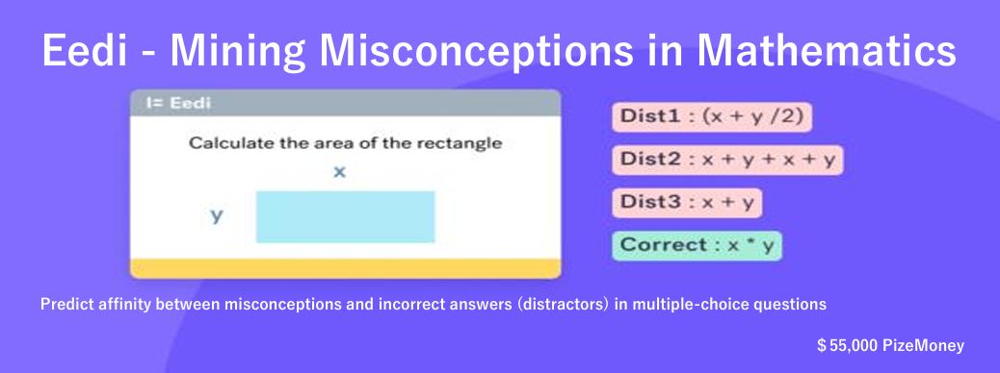
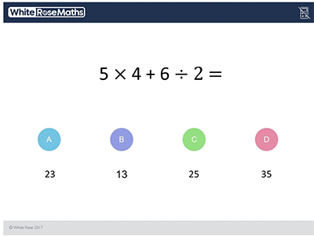
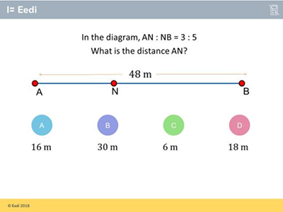

# kagggle-Eedi---Mining-Misconceptions-in-Mathematics
Eedi---Mining-Misconceptions-in-Mathematicsコンペのリポジトリ

## Basic

### Overview(ChatGPT)

診断問題とは、4つの選択肢（1つの正解と3つのディストラクター（不正解））から成る多肢選択問題のことです。各ディストラクターは、特定の誤解を捉えるように慎重に作成されています。例えば：



もし学生がディストラクター「13」を選択した場合、彼らは「優先順位に関係なく左から右へと演算を実行する」という誤解を持っている可能性があります。

ディストラクターに適切な誤解をタグ付けすることは重要ですが、時間がかかり、多くの人間のラベラー間で一貫性を保つのが難しいです。誤解は記述の詳細さにおいて大きく異なり、新しいトピック領域でディストラクターにタグ付けする際に新たな誤解が頻繁に発見されます。

事前に訓練された言語モデルを使用しようとする初期の試みは、問題の数学的内容の複雑さのために成功していません。したがって、タグ付けプロセスを効率化し、全体の品質を向上させるために、より効率的で一貫したアプローチが必要とされています。

このコンペティションでは、誤解とディストラクターの関連性を予測する機械学習（ML）に基づく自然言語処理（NLP）モデルの開発に挑戦します。目標は、既知の誤解に合致するだけでなく、新たに出現する誤解にも対応できるモデルを作成することです。こうしたモデルは、人間のラベラーが既存および新たに特定されたオプションから適切な誤解を正確に選択するのを支援します。

あなたの取り組みは、誤解の理解と管理を改善し、学生と教師の教育体験を向上させるのに役立つでしょう。

Eediは、ヴァンダービルト大学とアリゾナ州に拠点を置く独立系非営利団体であるThe Learning Agency Labと共に、このコンペティションをKaggleと協力して実施しています。

### Evaluation(ChatGPT)

提出物は Mean Average Precision @ 25 (MAP@25) に基づいて評価されます：

$$
MAP@25 = \frac{1}{U} \sum_{u=1}^{U} \sum_{k=1}^{\min(n, 25)} P(k) \times rel(k)
$$

ここで、

- $ U $ は観測の数です。
- $ P(k) $ はカットオフ $ k $ における精度です。
- $ n $ は各観測につき提出された予測の数です。
- $ \text{rel}(k) $ はランク $ k $ の項目が関連する（正しい）ラベルであれば $ 1 $、そうでなければ $ 0 $ となる指示関数です。

一度観測に対して正しいラベルが評価されると、そのラベルはその観測に対してもはや関連とみなされず、そのラベルの追加の予測は計算から除外されます。例えば、観測に対する正しいラベルが A である場合、以下の予測はすべて平均適合率 1.0 を得ます。

```python
[A, B, C, D, E]
[A, A, A, A, A]
[A, B, A, C, A]
```

各観測につき正しいラベルは1つだけであるため、内側の総和の前に除数項はありません。

### Dataset(ChatGPT)
Eediでは、学生が診断質問（DQs）に回答します。診断質問は、一つの正解と三つの不正解（ディストラクター）を含む多肢選択問題です。各質問は特定の構成要素（スキルとも呼ばれます）を対象としており、質問に関連する知識の最も細かいレベルを表しています。各ディストラクターは潜在的な誤解に対応するように設計されています。以下にDQsの例を示します：



この例では、質問の選択肢は以下のように誤解とラベル付けされています：
- A: 全体の量を比率の各側で割るのではなく、部分の合計で割る
- B: 比率の側を混同する
- C: 比率の一部を見つけるが、必要な部分の数で掛けない
- D: 正解


診断質問はもともと画像形式で提示されており、テキスト（数学的内容を含む）は人間が関与するOCRプロセスを使用して抽出されました。

### File and Field Information(ChatGPT)

**[train/test].csv**

| カラム名                   | データ型 | 説明                                                                                                  |
|----------------------------|----------|-------------------------------------------------------------------------------------------------------|
| QuestionId                 | int      | 一意の質問識別子                                                                                      |
| ConstructId                | int      | 一意の構成識別子                                                                                      |
| ConstructName              | str      | 質問に関連する最も詳細な知識のレベル                                                                  |
| CorrectAnswer              | char     | 正しい答え（A, B, C または D）                                                                        |
| SubjectId                  | int      | 一意の主題識別子                                                                                      |
| SubjectName                | str      | Constructよりも一般的な主題                                                                           |
| QuestionText               | str      | OCR（Human-in-the-loop）を使用して質問画像から抽出された質問テキスト                                  |
| Answer[A/B/C/D]Text        | str      | OCR（Human-in-the-loop）を使用して質問画像から抽出された選択肢のテキスト                               |
| Misconception[A/B/C/D]Id   | int      | 一意の誤解識別子。train.csvに真実のラベルとして含まれており、test.csvの予測対象                        |

**misconception_mapping.csv**

| カラム名           | データ型 | 説明                          |
|--------------------|----------|-------------------------------|
| MisconceptionId    | int      | MisconceptionNameに対応する誤解識別子 |
| MisconceptionName  | str      | 誤解の名称                    |

**sample_submission.csv**

| カラム名            | データ型 | 説明                                                                                                  |
|---------------------|----------|-------------------------------------------------------------------------------------------------------|
| QuestionId_Answer   | str      | 質問識別子と選択した回答を示す。例えば、"QuestionId_Answer" は "1_A"のように回答が正しいかを示す形式。 |
| MisconceptionId     | int      | 予測対象の誤解識別子（最大25件まで予測可能）。スペースで区切る。                                     |


## Discassionから抽出
- このコンペはLLMによる想起と類似度ランキングの典型的なコンペである
 また以下の３点がポイントになる可能性がある
    - Hard Negative Mining(今回のコンペでは効果なしとの意見もあり)
    - Larger Batch Size
    - Adjusting Training Parameters for LLMs

## 疑問点・試したいことメモ
- LLMを使用してtrainデータを増やすべきか？
    - trainデータは1869行だがデータセットとしては足りないか
    - ディスカッションで合成データが効果的と書いてあった
    - trainデータと同等の質のデータを作成することができるのか
    - LLMを使用してデータを作成するとそもそもの誤解の種類を誤る可能性がある
    - 外部データを作成し使用する場合は、そのデータセットを公開する必要がある（既にgpt4-miniを使用し作成された[データセット](https://www.kaggle.com/datasets/alejopaullier/eedi-external-dataset/data?select=train_external.csv)が公開されている）
- ファインチューニングの際に複数のシードトレーニングして平均を取ることは有効か
    - そもそもファインチューニングのやり方が分からないので調べながらやる必要がある
- 公開ノートブックには正解と現時点での類似度第一位の誤答を特徴量として追加していたが、第二位・第三位の誤答は追加が有効か
- ファインチューニングでKFold法を使用できるか

### 20241103
- join!
- データセットを確認
    - 問題に対してどのように解答を誤ったかを判別し、その誤解に関連する誤解の最大上位25個を予測するタスクで合ってるかな？
    - 「Misconception[A/B/C/D]Id」は不正解の３列に値が入っているべきじゃないのか？なぜ１列のみ値が入っている行が複数あるのか？
        - ただの欠損値である可能性が高い。→やはりただの欠損。欠損している行は使わない
- Vote数が多いEDAのノートブックを見始めた。

## 知らなかった単語
- ハッシュテーブル
    - キー（Key）と値（Value）のペアでデータを管理するデータ構造
- LaTeX形式のテキスト
    - 科学技術文書の作成に広く用いられている、キストとコマンドを組み合わせて、複雑な文書構造や数式を美しく整形するためのマークアップ言語
    - 例：アインシュタインの有名な式は $E = mc^2$ です。